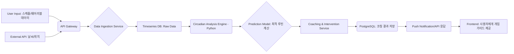

# 💻 Developer — 1. 앱의 핵심 기능(수면 패턴 입력 → 생체 리듬 분석 → 맞춤형 교정 가이드 제공)을 기반으로 기술 아키텍처를 설계할 것. 2. MVP 단계에서 필요한 데이터 수집(Input)과 분석 로직(Algorithm)의 백엔드 데이터 흐름도(Data Flow Diagram)를 작성하고, 필요한 외부 API(예: 날씨, 시간대 정보) 연동 계획을 제시할 것.

💻 Developer: 작업 시작합니다.

## 🛠️ 1. 기술 아키텍처 설계 (Technical Architecture Design)

제시된 핵심 가치 제안(CVP)인 'Predictive Intervention Engine'을 구현하기 위해, 단순한 CRUD(Create, Read, Update, Delete) 구조를 넘어 복잡한 데이터 처리와 예측 모델링이 가능한 **마이크로서비스 아키텍처(Microservices Architecture)**를 채택해야 합니다.

| 구성 요소 | 기술 스택 (권장) | 역할 및 이유 |
| :--- | :--- | :--- |
| **Frontend (Client)** | React Native / Flutter | 크로스 플랫폼 MVP 구현에 최적. (iOS/Android 동시 배포 용이) |
| **API Gateway** | AWS API Gateway / Nginx | 모든 외부 호출의 단일 진입점 역할. 인증, 속도 제한, 로깅을 중앙에서 처리하여 백엔드를 보호합니다. |
| **Core Service (Backend)** | Python (Django/Flask) | **핵심 로직 구현에 최적.** 생체 리듬 계산, 기계 학습(ML) 모델 구동 등 복잡한 알고리즘 처리에 파이썬이 가장 유리합니다. |
| **Data Storage (DB)** | PostgreSQL (Supabase 기반) | 사용자 프로필, 스케줄 데이터, 코칭 결과 등 구조화된 데이터를 저장. 강력한 트랜잭션 처리와 확장성이 보장됩니다. |
| **Time-Series DB** | InfluxDB 또는 TimescaleDB | 수면 단계, 심박수, 활동량 등 시간의 흐름에 따라 기록되는 **시계열 데이터**를 효율적으로 저장하고 빠르게 쿼리하기 위해 필수적입니다. |
| **Queue/Message Broker** | Redis / RabbitMQ | 외부 API 호출, ML 모델 재학습, 푸시 알림 전송 등 **비동기적이고 시간 지연이 허용되는 작업**을 처리하여 시스템 부하를 분산시킵니다. |

---

## 🌊 2. 백엔드 데이터 흐름도 (Data Flow Diagram: Data Flow)

앱의 목표는 '데이터 수집' $\rightarrow$ '분석' $\rightarrow$ '개입'이므로, 데이터가 어떻게 흐르고 가공되는지 명확한 파이프라인을 설계해야 합니다.

### 📌 데이터 흐름 요약
**[Input]** $\rightarrow$ **[Ingestion & Standardization]** $\rightarrow$ **[Core Processing (Prediction)]** $\rightarrow$ **[Output Generation]**

### 💾 상세 데이터 흐름 (Conceptual Flow)

### 💡 핵심 로직 설명 (Algorithm Focus)

1.  **Data Ingestion Service:**
    *   수집된 모든 원시 데이터(Wearable, Manual)를 시간대(Timezone)와 스케줄에 맞게 정규화(Normalization)합니다.
    *   데이터 유효성 검사(Validation)를 수행합니다.
2.  **Circadian Analysis Engine (가장 중요):**
    *   **입력:** 현재 스케줄, 이전 수면 데이터, 외부 환경(날씨, 빛 노출량 추정).
    *   **로직:** 수면 부족 정도(Sleep Debt)와 생체리듬 불일치 지수(Circadian Misalignment Score)를 계산합니다.
    *   **출력:** 현재의 생체 리듬 상태와 '개입이 필요한 영역'을 식별합니다.
3.  **Prediction Model:**
    *   **로직:** '최적의 GCR(Goal Completion Rate)'을 달성하기 위해 필요한 '이상적인 수면 시간, 각성 시간, 환경 변화'를 역산합니다.
    *   **출력:** `Optimal_Sleep_Start_Time`, `Optimal_Wake_Time`, `Required_Intervention_Minutes`

---

## 🌐 3. 외부 API 연동 계획 (External API Integration Plan)

앱의 코칭 정확도를 높이기 위해 필수적인 외부 데이터 소스를 선정하고, 이를 어떻게 활용할지 정의합니다.

| API 종류 | 제공 목적 | 활용 시나리오 (Coaching) | 구현 난이도 |
| :--- | :--- | :--- | :--- |
| **1. Time Zone API** | 전 세계 시간대 정보 (UTC Offset) | 교대 근무자가 다른 지역에서 근무할 경우, **모든 시간 데이터를 정확하게 동기화**하고 루틴을 재설정하는 데 필수적입니다. | Low |
| **2. Weather API** | 실시간 날씨 및 기상 정보 (기온, 습도, 일출/일몰 시간) | 수면 환경 최적화 코칭에 사용. 예: "오늘 습도가 높으니, 취침 전 가습기 사용을 권장합니다." | Medium |
| **3. Location/GPS API** | 사용자 현재 위치 및 이동 경로 | 수면 환경의 '빛 노출 패턴'을 추정하거나, 근무지 이동 시의 수면 부족 위험도를 계산하는 데 사용합니다. | Medium |
| **4. (선택) Calendar API** | 구글/아웃룩 등 캘린더 연동 |
